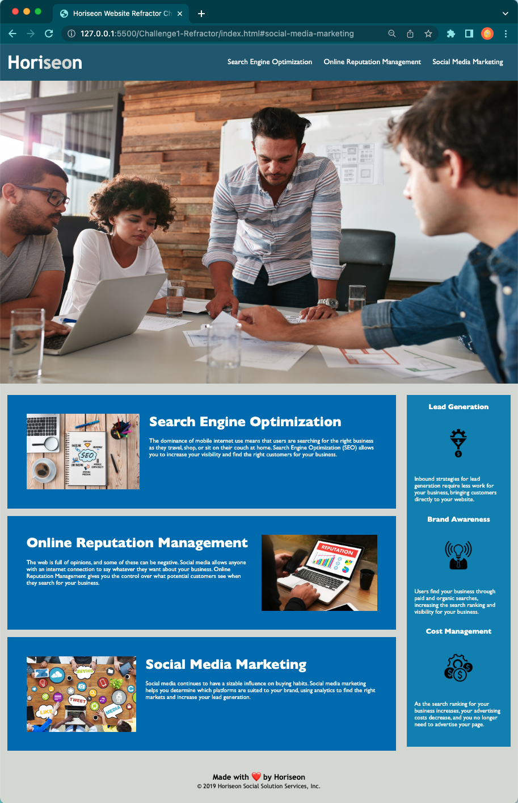

# Challenge1-Refractor

## Description

This website was a challenge for the Full-stack coding bootcamp course.  It portrayed a scenario that could prepare students for what they'd encounter in real-life as a web developer.  An on-the-job ticket was simulated as students were challenged to modify and clean up the starter code.  The simulation was presented as this: You are being hired by a client to help with their website.  The task is a code refractor to improve the code without changing what it does for the website of the marketing agency called "Horiseon."  I took on the following User Story provided:
"AS a marketing agency
I WANT a codebase that follows accessibility standards
SO THAT our own site is optimized for search engines."
When cleaning up the code web accessibility standards were also considered and implemented to meet requirements.  By linearly organizing the code with HTML semantics it makes the site easier for it to show up in a search engine. Duplicate CSS properties were also consolidated to clean up code. This solves the issue of hard-to-read code by making it syntactically readable and disability accessible.   In this simulation, I was put in a real-life issue that may arise in my future as a web developer.  I was able to practice and apply what I have learned of HTML, Github, and CSS so far.  

Link to live site:
https://p-trish.github.io/Challenge1-Refractor/

## Installation

N/A

## Usage

This website contains accessible alt attributes for images.  The navigation bar in the header links the user to each featured section listed.  

## Credits

N/A

## License

Please refer to the LICENSE in the repo. 

## Features

The navigation bar links to each section of the page. Accessible alt attributes provide descriptions for images.  

Currently, the features are applicable for a desktop page however, in the future this site can be utilize Advanced CSS attributes such as media queries.  